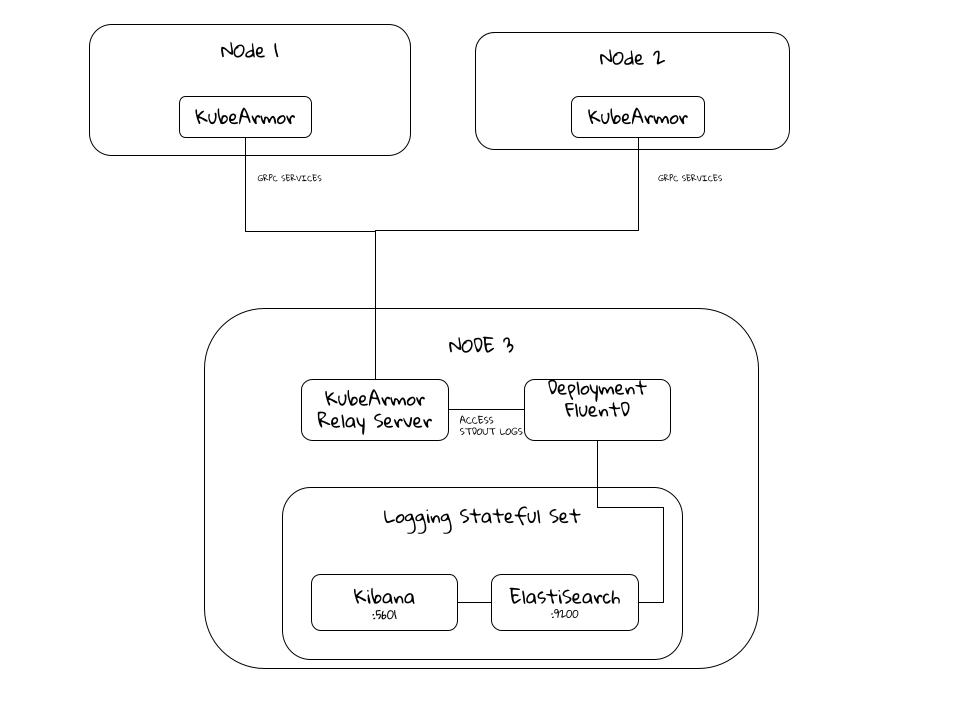
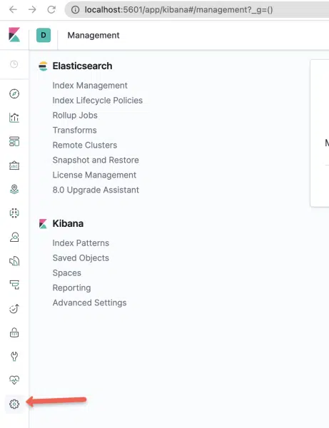
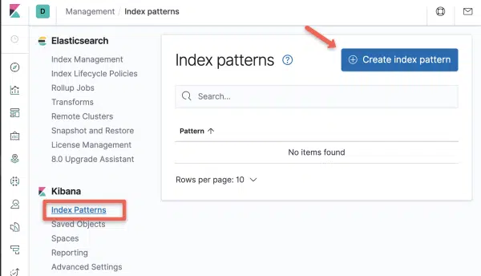
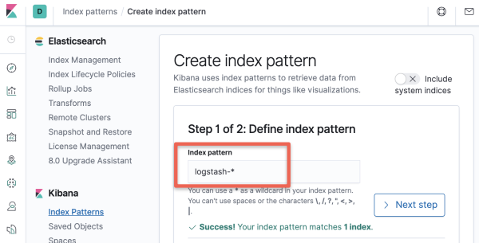
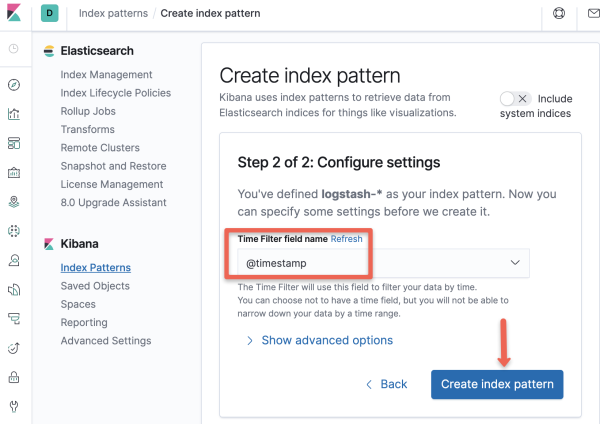
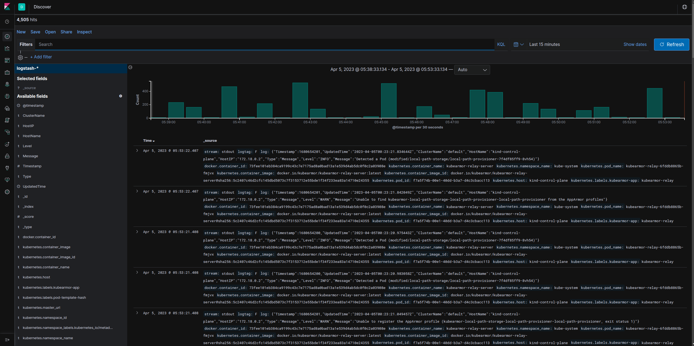

# kubearmor-elasticstack-logging


## EFK (Elasticsearch, Fluentd and Kibana) [WIP]




There would be 3 components in this setup:

1. **Elasticsearch** is a real-time, distributed, and scalable search engine which allows for full-text and structured search, as well as analytics. Relay server data can be indexed and searched through which would be produced in large volumes of log data.

2. **Kibana** is a data visualization frontend and dashboard for Elasticsearch. Kibana allows user to explore the log data in a visual manner that is stored in the Elasticsearch instance with the help of a web interface. Users would also be allowed to build dashboards or view existing ones which would help to answer the quickly gain insight about the pods managed by KubeArmor:

- Security policies deployed for their pods
- Alerts for each policy in a pod
- Alerts filtered by severity
- Alerts filtered by type (MatchedPolicy, MatchedHostPolicy, MatchedNativePolicy)
- Alerts filtered by operation (Process, File, Network, Capabilities)
- Alerts filtered by action (Allow, Audit, Block)

Kibana and ElastiSearch can be part of a Stateful set that runs in the node where grp

3. **FluentD**

FluentD allows you to unify data collection and consumption for a variety of data sources, including logs, metrics, and other event data, and route them to various destinations, 


How to deploy FluentD:

Daemonset - There is official support for that from FluentD at [fluentd-kubernetes-daemonset](https://github.com/fluent/fluentd-kubernetes-daemonset)

The manifest used are inspired from it

**Fluentd Config map**

A config map is used to store the configuration to be used by fluentd instance in the container
The config map used has the coniguration in 2 files 

```

 fluent.conf: |
   #@include systemd.conf
   @include kubernetes.conf
   <match **>
      @type elasticsearch
      @id out_es
      @log_level info
        ........ELASTISEARCH PARAMETERRS
      </buffer>
   </match>
 kubernetes.conf: |
   <source>
     @type tail
     @id in_tail_container_logs
     path /var/log/containers/kubearmor-relay-*.log
     pos_file /var/log/fluentd-kubearmor-relay.log.pos
     tag kubernetes.*
     exclude_path ["/var/log/containers/fluent*"]
     read_from_head true
     <parse>
       @type regexp
       expression /^(?<time>.+) (?<stream>stdout|stderr)( (?<logtag>.))? (?<log>.*)$/
     </parse>
   </source>
   <filter kubernetes.**>
     @type kubernetes_metadata
     @id filter_kube_metadata
   </filter>
   <filter kubernetes.var.log.containers.**>
     @type parser
     <parse>
       @type json
       json_parser json
     </parse>
     replace_invalid_sequence true
     emit_invalid_record_to_error false
     key_name log
     reserve_data true
   </filter>

```

To store the configuration for FluentD, we can store as ConfigMaps.

Configuration would require:

- `source` directives determine the input sources.   
    here we want to monitor relay logs so 
    * path is set to `/var/log/containers/kubearmor-relay-*.log`
    * tag `kubernetes.*` directive tells Fluentd to assign a tag to the log events generated by the tail plugin. the `* character` ,  will be replaced with the actual pod and container name.
- `match` directives determine the output destinations.
    * `elasticsearch` configures the logs to be sent to the elastisearch instance
- `filter` directives determine the event processing pipelines.
    * `kubernetes_metadata` adds k8s specific information to the log event like such as the pod name, container name, namespace, and labels
    * `parser` plugin parses the actual nested json logs in the relay pod


***How config-map is used in the fluentd instance***

A initContainer first mounts the files from configmap to `/fluentd/etc/` which is used by by fluentd in the instance

      - name: config-fluentd
        image: busybox
        imagePullPolicy: IfNotPresent
        command: ["/bin/sh","-c"]
        args:
        - cp /fluentd/etc2/fluent.conf /fluentd/etc/fluent.conf;
          cp /fluentd/etc2/kubernetes.conf /fluentd/etc/kubernetes.conf;
        volumeMounts:
        - name: config-path
          mountPath: /fluentd/etc
        - name: config-source
          mountPath: /fluentd/etc2
 
 
***Connection with Elastisearch***

The exposed service of the elastisearch is passed on as environment variables in the main `fluentd` container 

        env:
          - name:  FLUENT_ELASTICSEARCH_HOST
            value: "elasticsearch.default.svc.cluster.local"
          - name:  FLUENT_ELASTICSEARCH_PORT
            value: "9200"
          - name: FLUENT_ELASTICSEARCH_SCHEME
            value: "http"


***Access to logs present in host from relay-pod***


The logs from `kubearmor-relay` are in `stdout` , so they are stored in `/var/log/containers` in the host . To access that it will be mounted to the fluentd container usi ng `volumes` and `volumeMounts`

The access permissiona are managed by `ClusterRoleBinding`


**How to deploy**

1. Deploy Elasticsearch:
    ```
    kubectl apply -f deployments/elasticsearch/es-sts.yaml
    kubectl apply -f deployments/elasticsearch/es-svc.yaml
    ```
2. Deploy Kibana:
    ```
    kubectl apply -f deployments/kibana/kibana-deployment.yaml
    kubectl apply -f deployments/kibana/kibana-svc.yaml
    ```
3. Deploy Fluentd:
    ```
    kubectl apply -f deployments/fluentd
    ```
4. Access the Dashboards:
    ```
    kubectl port-forward deployment/kibana 5601:5601
    ```
    Open up your favorite browser and go to `localhost:5601`.


5. Open the Kibana UI using a proxy or the NodePort service endpoint, and head to the Management Console inside it.



Step 2: Select the “Index Patterns” option under Kibana section.



Step 3: Create a new Index Pattern using the pattern – “logstash-*”.



Step 4: Select “@timestamp” in the timestamps option.



Expected Dashboard 



***Troubleshoot***

1. Verify Elasticsearch Deployment

  ```
  kubectl port-forward es-cluster-0 9200:9200
  ```

  * curl to check health status

    ```
     curl http://localhost:9200/_cluster/health/?pretty
     ```

2. Verify Kibana Deployment


  ```
  kubectl port-forward deployment/kibana 5601:5601
  ```
  * curl to check if UI is loaded
  ```
  curl http://localhost:5601/app/kibana
  ```


