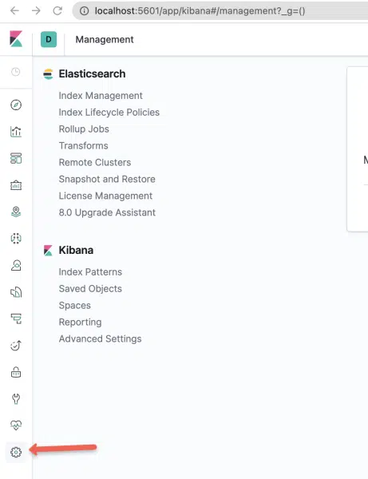
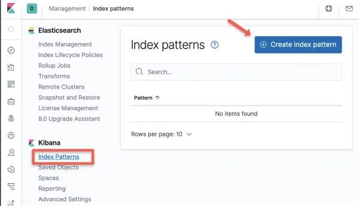

Open the Kibana UI using portforward   
```kubectl port-forward deployment/kibana 5601:5601```   
Open ```localhost:5601``` in your browser  and head to the Management Console inside it.



Step 2: Select the “Index Patterns” option under Kibana section.



Step 3: Create a new Index Pattern using the pattern – “logstash-*”.


Step 4: Select “@timestamp” in the timestamps option.


Expected Dashboard 

